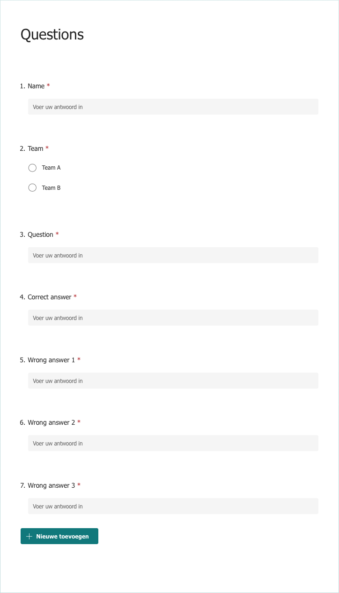
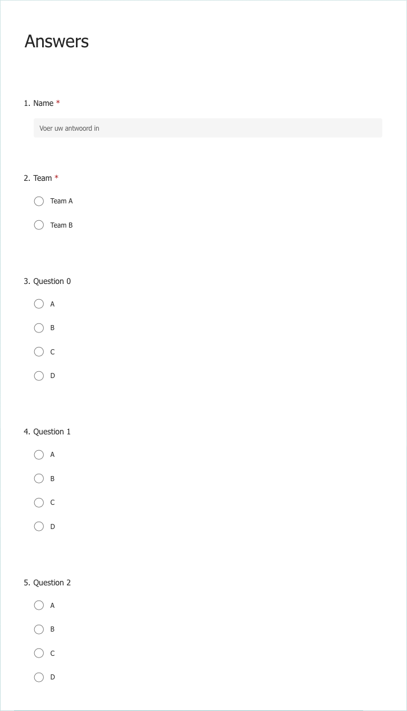

# Team Quiz Powerpoint Generator

This is a tool to generate a pub quiz style Powerpoint based on questions received from a microsoft form.
Then a seperate microsoft form is used to collect answers.
A solutions presentation can be generated including a scoreboard and graphs.
Teams can be used, so that groups of players can compete.

## Installation

1. Clone or download this repository
    ```shell
   git clone https://github.com/robertdijk/team_quiz_powerpoint.git
    ```
2. Install the package
    ```shell
   pip install . 
   ```

## Preparation

1. Create a config file. See `config_example.toml` for an example.
   ```shell
   cp config_example.toml config.toml
   ```

   ```toml
   title = "Quiz title" # The title that appears on the title slides.
   pickle-file="quiz.pickle" # The file to save the quiz in once imported
   template-file="template.pptx" # The template powerpoint to use
   
   [import.questions.fields] # These have to match the fields in the questions form
   name-field = "Name"
   team-field = "Team"
   question-field = "Question"
   correct-answer-field = "Correct answer"
   wrong-answer-field-1 = "Wrong answer 1"
   wrong-answer-field-2 = "Wrong answer 2"
   wrong-answer-field-3 = "Wrong answer 3"
   
   [import.answers.fields] # These have to match the fields in the questions answers
   name-field = "Name"
   team-field = "Team"
   question-field = "Question {}"
   
   [question-presentation]
   file = "questions.pptx" # The output file for generating the questions presentation
   timer = true # Whether to use the 20 sec timer in the presentation
   music = true # Whether to use the music with the timer
   end-title = "End" # The text on the last slide of the questions
   
   [question-presentation.rules-slide] # Add this section if you want a rules slide
   title = "Rules" # The title of the rules slide
   rules = [       # The actual rules
       "Rule 1",
       "Rule 2",
   ]
   
   [question-presentation.qr-slide] # Add this section if you want a qr-code slide
   title = "Scan the QR-code" # The title of the qr-code slide
   url = "example.com" # The link the qr-code should go to, change this to the link of the answers form
   
   [solution-presentation]
   file = "solutions.pptx" # The output file for generating the solutions presentation
   music = true # Whether to use music during the presentation
   podium-slide = true # Whether to have a podium slide
   team-slide = true # Whether to have a teams score slide
   ```

2. Create a Microsoft Form to receive the questions.
    - The spelling of the fields need to match up with your config file.
    - You can create any number of teams here, with any name.
    - Make it similar to this:
      

3. Create a Microsoft Form to receive the answers.
    - The spelling of the fields need to match up with your config file.
    - Make sure the teams match up with the teams in the previous form.
    - Start with question 0
    - Make as many questions as the max you expect.
    - Make the questions not required.
    - Make it similar to this:
      

## Usage

1. Let people fill in the form
2. Download the responses as an excel
   file. [How do I export my form responses?](https://support.microsoft.com/en-gb/office/how-do-i-export-my-form-responses-fb0aee53-0fd9-43bf-9c48-af081b6895d5)
3. Import the questions
   ```shell
   import_questions questions.xlsx # replace with downloaded file
   ```
4. Generate the question slides
   ```shell
   generate_questions_presentation
   ```
5. Open the questions presentation and play the quiz!
6. Download the answers as an excel
   file. [How do I export my form responses?](https://support.microsoft.com/en-gb/office/how-do-i-export-my-form-responses-fb0aee53-0fd9-43bf-9c48-af081b6895d5)
7. Import the answers
   ```shell
   import_answers answers.xlsx # replace with downloaded file
   ```
8. Generate the solution slides
   ```shell
   generate_solutions_presentation
   ```
9. Show the solutions, and award your prizes!
   
## Credits

- Music by <a href="https://pixabay.com/nl/users/mondayhopes-22948862/?utm_source=link-attribution&amp;utm_medium=referral&amp;utm_campaign=music&amp;utm_content=8018">Jiwon (Musician) Nahee (Graphic Designer)</a> from <a href="https://pixabay.com//?utm_source=link-attribution&amp;utm_medium=referral&amp;utm_campaign=music&amp;utm_content=8018">Pixabay</a>
